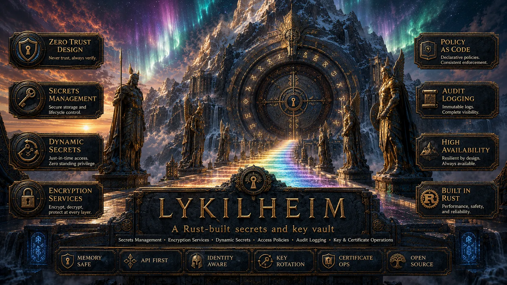

<p align="center">
  <b>Rust-native, API-driven secrets manager planned as a secure Vault/OpenBao alternative.</b><br>
  Memory-safe by design. Auditable by default. Ready for rootless containers.
</p>

<div align="center">
  <a href="docs/version-plan.md">Version Plan</a>
  ·
  <a href="docs/feature-parity.md">Feature Parity</a>
  ·
  <a href="release-notes">Release Notes</a>
  ·
  <a href="SECURITY.md">Security</a>
</div>

<br>

<p align="center">
  
</p>

# Lykilheim

Lykilheim is a planned from-scratch Rust secrets manager inspired by the
operational model of HashiCorp Vault and OpenBao. The target is a fully
API-driven vault with encrypted storage, fail-closed audit behavior, token and
lease management, policy enforcement, rootless Wolfi containers, and a clear
path toward safe extension through native adapters and sandboxed Wasm plugins.

Current status: `0.1.0` foundation work. The repository has the first Rust
crate, governance, security policy, release notes, a feature-parity audit,
versioned implementation plan, API-shape docs, and rootless container
placeholders.

Lykilheim is licensed under the European Union Public Licence 1.2.

## What Exists Today

### Planning And Governance

| Capability | Status | Notes |
| --- | --- | --- |
| Version plan | Present | Release ladder from `0.1.0` through `2.0.0`, with STOP gates before every release. |
| Release notes | Present | One Fluxheim-style release-note file per planned release. |
| Feature parity audit | Present | Vault/OpenBao coverage tracked as `1.0`, preview, post-1.0, research, or intentionally different. |
| Security policy | Present | Covers disclosure, dependency policy, crypto posture, and release evidence. |
| GitHub metadata | Present | Contributing guide, PR template, issue template, Dependabot, CODEOWNERS, and CI bootstrap. |
| Rust toolchain | Present | Rust `1.96.0` pinned in `rust-toolchain.toml`. |
| Rust crate | Present | Foundation modules for API, config, errors, audit, crypto, storage, and tests. |
| Bootstrap checks | Present | `scripts/checks.sh` validates metadata, docs, formatting, clippy, and tests. |

### First Stable Target

| Capability | Status | Target |
| --- | --- | --- |
| API-driven init, seal, unseal, health, and version | Planned | `1.0.0` |
| Encrypted storage barrier | Planned | `1.0.0` |
| Shamir unseal, rekey, and key rotation | Planned | `1.0.0` |
| Audit devices with fail-closed behavior | Planned | `1.0.0` |
| Token engine, leases, renewal, and revocation | Planned | `1.0.0` |
| Policy engine and capabilities APIs | Planned | `1.0.0` |
| Identity, aliases, groups, and namespaces base | Planned | `1.0.0` |
| KV v2, cubbyhole, and response wrapping | Planned | `1.0.0` |
| AppRole and userpass baseline auth | Planned | `1.0.0` |
| Transit baseline and PKI baseline | Planned | `1.0.0` |
| Backup/restore and storage migrations | Planned | `1.0.0` |
| Standalone binary and rootless Wolfi container | Planned | `1.0.0` |

### Post-1.0 Differentiators

| Capability | Status | Target |
| --- | --- | --- |
| Secret inventory | Planned | `1.1.0` |
| Policy simulator | Planned | `1.1.0` |
| Dry-run blast-radius mode | Planned | `1.1.0` |
| Local-first developer mode | Planned | `1.1.0` |
| Secret leak intake | Planned | `1.2.0` |
| Rotation readiness scoring | Planned | `1.2.0` |
| Lifecycle webhooks | Planned | `1.2.0` |
| Adapter conformance framework | Planned | `1.3.0` |
| Human approval workflows | Planned | `1.4.0` |
| Break-glass mode | Planned | `1.4.0` |
| Tamper-evident audit bundles | Planned | `1.5.0` |
| Stable Wasm extension platform | Planned | `2.0.0` |

## Why Lykilheim

- **Rust first**: memory-safe implementation with a pinned stable toolchain.
- **API first**: every operator workflow should be possible through documented
  APIs; CLI tooling can wrap APIs but should not be the control plane.
- **Security first**: fail closed where audit, authorization, cryptography, or
  storage integrity cannot be proven.
- **Documentation first**: user-facing features, APIs, configuration,
  deployment paths, and security behavior are not done until they are documented.
- **Rootless ready**: standalone binary and rootless Wolfi container operation
  are first-class release gates.
- **Portable binary**: the standalone server should work on Linux, macOS,
  Windows, and BSD-style Unix systems; the hardened Wolfi container remains
  Linux-only.
- **Parity-aware**: Vault/OpenBao features are tracked explicitly so missing
  behavior is scheduled, deferred, or intentionally different.
- **Extensible later**: native adapters come first; sandboxed Wasm plugins are a
  later major-version goal after review.

## Quick Start

Validate the current bootstrap repository:

```bash
scripts/checks.sh
```

Read the implementation plan:

```bash
sed -n '1,220p' docs/version-plan.md
```

Read the Vault/OpenBao feature audit:

```bash
sed -n '1,220p' docs/feature-parity.md
```

The normal local checks currently run:

```bash
cargo fmt --all --check
cargo clippy --all-targets -- -D warnings
cargo test
cargo deny check bans licenses sources
cargo audit --db target/advisory-db
```

`cargo-deny` and `cargo-audit` are required for `scripts/checks.sh` once the
Rust crate exists.

## Planned Release Lines

Lykilheim does not treat every planned idea as part of `1.0.0`.

- `0.1.0` starts the crate, threat model, checks, and documentation index.
- `0.2.0` builds sealed storage and the cryptographic barrier.
- `0.3.0` adds API routing, audit, policy skeleton, mounts, wrapping design,
  and cubbyhole design.
- `0.4.0` adds tokens, leases, KV v2, identity, and cubbyhole storage.
- `0.5.0` adds AppRole and userpass baseline authentication.
- `0.6.0` adds transit and PKI baseline services.
- `0.7.0` adds rootless Wolfi operations, backup/restore, and metrics.
- `0.8.0` adds Raft high-availability preview and replication boundaries.
- `0.9.0` adds plugin and dynamic adapter preview work.
- `0.10.0` freezes the `1.0.0` compatibility contract.
- `1.0.0` is the first stable vault foundation.
- `1.1.0` through `1.5.0` add operator intelligence, leak response, adapter
  certification, human approval, and tamper-evident operations.
- `2.0.0` is the planned sandboxed extension-platform major release.

See [Version Plan](docs/version-plan.md) for the complete release ladder and
STOP gates.

## Adapter Roadmap

Lykilheim will use provider-specific adapters behind common engine traits.
Early adapters should be compiled into the binary behind explicit Cargo
features; later adapters may be sandboxed Wasm plugins.

| Adapter family | Initial targets |
| --- | --- |
| SQL databases | PostgreSQL, MySQL, MariaDB |
| Document databases | MongoDB |
| Multi-model databases | SurrealDB |
| Cache/key-value services | Redis, Valkey |
| Message brokers | RabbitMQ |
| Public cloud providers | AWS, Azure, GCP |
| European/cloud infrastructure providers | Hetzner, DigitalOcean |
| Extensible providers | Custom signed Wasm adapters |

Every adapter must document upstream API calls or statements, minimum
privileges, lease behavior, revocation behavior, audit redaction, failure modes,
and local smoke coverage where practical.

## Documentation

- [Version Plan](docs/version-plan.md)
- [Documentation Index](docs/index.md)
- [Architecture](docs/architecture.md)
- [API Reference](docs/api-reference.md)
- [Local Development](docs/local-development.md)
- [Build And Podman](docs/build-and-podman.md)
- [Release Checklist](docs/release-checklist.md)
- [Feature-Parity Audit](docs/feature-parity.md)
- [Security Model](docs/security-model.md)
- [Portability Policy](docs/portability.md)
- [Security Policy](SECURITY.md)
- [Release Notes](release-notes)
- [Contributing](.github/CONTRIBUTING.md)
- [Pull Request Template](.github/PULL_REQUEST_TEMPLATE.md)
- [Issue Template](.github/ISSUE_TEMPLATE/bug_report.yml)

Planned documentation areas for later implementation releases:

- configuration reference;
- operator guide;
- storage and backup/restore guide;
- audit guide;
- auth, identity, policy, token, lease, KV v2, cubbyhole, wrapping, transit, and
  PKI guides;
- rootless Podman and Wolfi guide;
- adapter and plugin guides;
- release checklist and release verification guide.

## Security And Dependency Policy

Lykilheim uses or will use:

- pinned Rust stable toolchain;
- GitHub CI and CodeQL default setup;
- `cargo deny` for license and dependency policy once the crate exists;
- `cargo audit` for advisory checks once the crate exists;
- SBOM and checksum evidence for release artifacts;
- rootless Podman smoke tests before container releases;
- explicit STOP gates and pentest/review before every release.

Before publishing or merging security-sensitive changes:

```bash
scripts/checks.sh
```

Before cutting the `0.1.0` release candidate:

```bash
scripts/release_0_1_gate.sh
LYKILHEIM_RELEASE_PODMAN=1 scripts/release_0_1_gate.sh
```

Build native standalone release artifacts on each target OS:

```bash
python3 scripts/build_release_binary.py linux --ref v0.1.0
```

Use `macos`, `bsd`, or `windows` for the matching host. See
[docs/release-binaries.md](docs/release-binaries.md). Native ARM hosts are
supported; use `--target` only when the build host is prepared for an explicit
Rust target triple.

The gate writes evidence to `target/release-evidence/0.1.0/`. The focused
pentest scope is documented in
[docs/pentest-0.1.0.md](docs/pentest-0.1.0.md).

See [SECURITY.md](SECURITY.md) for vulnerability reporting and release
supply-chain expectations.

## License

Lykilheim is distributed under the
[European Union Public Licence v1.2](LICENSE).
